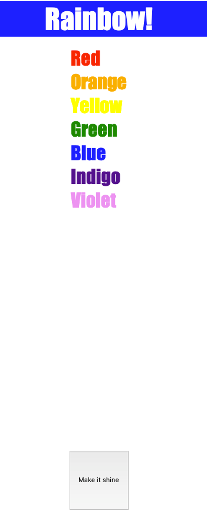

# Exercise 7: Rainbow (iteration over multiple elements and changing inline styles)

Add an event listener to the `button` with the class `shine-button`, so when it's get clicked (`click` event) the `li` with the class `list__item` change their style color to the color they have written in the text.

## Expected Result

## Resources

- [MDN: document.querySelectorAll](https://developer.mozilla.org/en-US/docs/Web/API/Document/querySelectorAll)
- [JavaScript.info: querySelectorAll](https://javascript.info/searching-elements-dom#querySelectorAll)
- [JavaScript.info: Element Style](https://javascript.info/styles-and-classes#element-style)
- [JavaScript.info: Intro to browser events](https://javascript.info/introduction-browser-events#addeventlistener)
  - There is a chapter in this article about the `addEventListener` function.
- [FreeCodeCamp Article on Event Listeners](https://www.freecodecamp.org/news/javascript-addeventlistener-example-code/)
